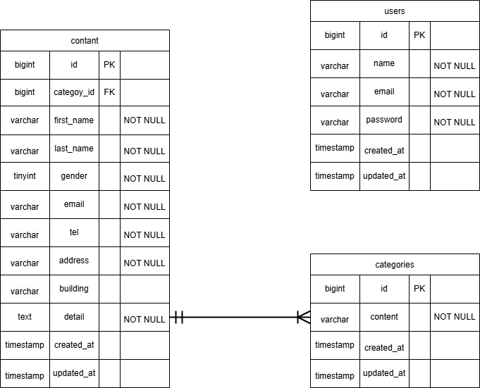

# inquiry-form


## 環境構築

### ディレクトリのクローン

```bash
git clone git@github.com:izumiyuki214/Inquiry-form.git
```

---

### Docker 起動

```bash
docker-compose up -d --build
```

---

### コンテナにアクセス

```bash
docker-compose exec php bash
```

---

### パッケージのインストール

```bash
composer install
```

---

### エラーが起きた際はこちらを入力してください

```bash
mkdir -p storage/framework/{views,cache,sessions} bootstrap/cache
chmod -R 775 storage bootstrap/cache
```

---

### 環境変数の設定

```bash
cp .env.example .env
```

---

### 暗号キー生成

```bash
php artisan key:generate
```

---

### マイグレーション

```bash
php artisan migrate
```

---

### シーディング

```bash
php artisan db:seed
```

---

## リンク一覧

・お問い合わせ画面 http://localhost
・ログイン画面 http://localhost/login
・データベース確認 http://localhost:8080/

---

## ディレクトリ構成
src/
├─ app/
│  ├─ Http/Controllers/
│  │  ├─ AdminController.php        # 管理画面（検索・削除・CSVなど）
│  │  ├─ ContactController.php      # お問い合わせ送信フロー
│  │  └─ UserController.php         # 認証/ユーザー関連
│  ├─ Http/Requests/
│  │  └─ ContactRequest.php         # バリデーション
│  ├─ Models/
│  │  ├─ Contact.php                # Contactモデル（検索スコープ等）
│  │  ├─ Category.php               # お問い合わせ種別
│  │  └─ User.php
│  └─ Actions/Fortify/              # Fortify（ログイン/登録）
│
├─ resources/
│  └─ views/
│     ├─ index.blade.php            # 管理画面
│     ├─ contact.blade.php          # お問い合わせ入力
│     ├─ confirm.blade.php          # 確認画面
│     ├─ thanks.blade.php           # 完了画面
│     ├─ auth/                      # ログイン/登録画面
│     └─ layouts/app.blade.php      # 共通レイアウト
│  
└─ routes/
   └─ web.php                       # ルーティング

## 使用環境

- OS: Ubuntu 24.04.3 LTS
- PHP 8.4.14
- Laravel: 8.83.29
- MySQL: 8.0.45



